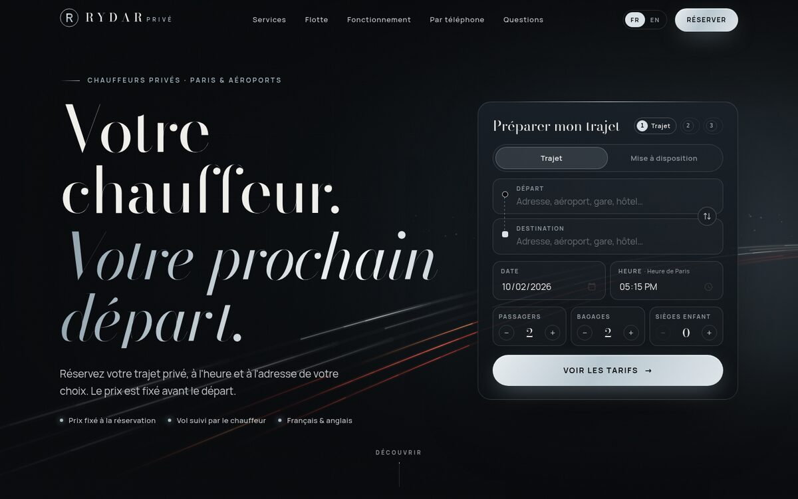
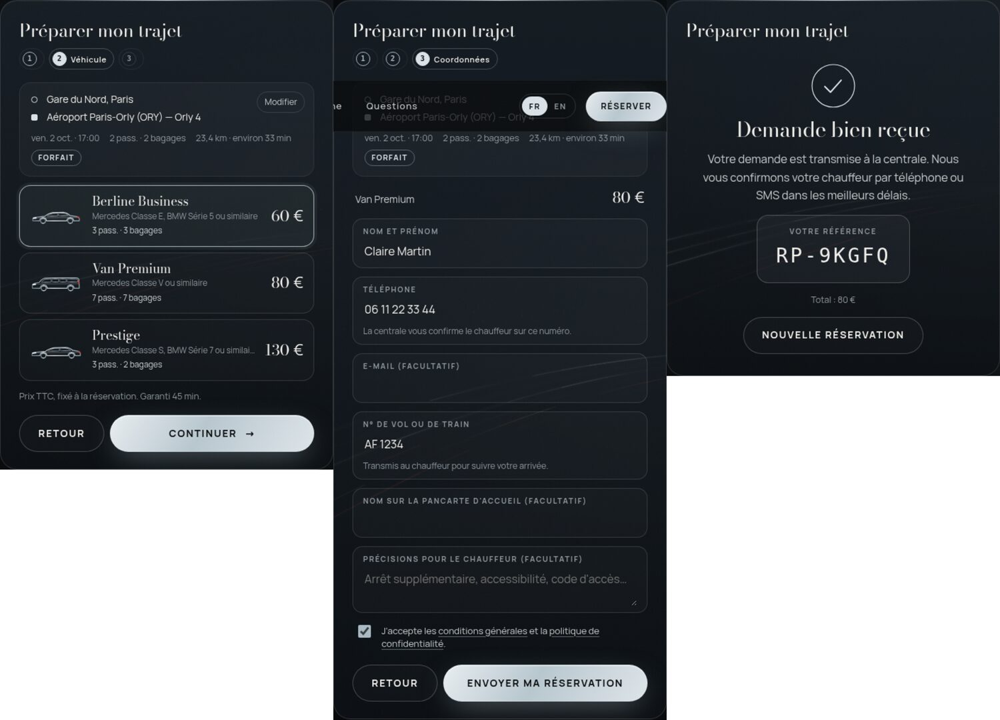

# RYDAR Privé

Site de réservation de chauffeurs privés (FR / EN) + assistant téléphonique IA + centrale de dispatch sur Telegram.

- **Le site** : design sombre et platine, réservation en 3 étapes avec prix calculé par le serveur (forfaits aéroports, tarif kilométrique, mise à disposition à l'heure). Il comprend aussi des pages SEO (CDG, Orly, chauffeur Paris, mise à disposition) et les pages légales.
- **L'IA au téléphone** (ElevenLabs + Twilio) : elle répond en français, en anglais ou dans d'autres langues, calcule le prix avec la même grille que le site et enregistre la réservation.
- **La centrale Telegram** : chaque réservation (site ou téléphone) arrive dans votre groupe avec le prix, la part chauffeur et votre commission.
  - Boutons : **🚘 Je prends la course**, 🏁 Terminée, ↩️ Libérer, ❌ Annuler (admins seulement).
  - Un seul chauffeur peut prendre une course.
  - Après chaque appel, un récapitulatif arrive dans le groupe, avec une alerte si aucune réservation n'a été faite.





```
 Client ──► Site web ─────────┐
                              ├──► Moteur de prix (serveur) ──► Réservation ──► Groupe Telegram "Centrale"
 Client ──► Téléphone (IA) ───┘                                                    │
                                                                    Chauffeur : « 🚘 Je prends la course »
```

---

## 1. Mettre le site en ligne (≈ 15 min)

1. Créez un compte sur **[vercel.com](https://vercel.com)** et connectez votre GitHub.
2. **Add New → Project** → importez le dépôt `Rydar-Course` → **Deploy**.
3. Dans **Settings → Environment Variables**, ajoutez au minimum :
   - `APP_SECRET` : une longue chaîne aléatoire. Elle signe les devis et protège la page `/setup`. Sur Mac/Linux : `openssl rand -hex 32`.
   - `NEXT_PUBLIC_SITE_URL` : `https://votre-domaine.com`.
   - `NEXT_PUBLIC_PHONE_DISPLAY` et `NEXT_PUBLIC_EMAIL` : votre contact.
4. **Deployments → Redeploy**. Faites-le après chaque modification de variable.
5. Domaine : **Settings → Domains** → ajoutez `rydarprive.com` (à acheter chez Vercel ou ailleurs).

> Pour un usage commercial, Vercel demande l'offre **Pro**.

Toutes les variables sont décrites dans [`.env.example`](.env.example).

## 2. Brancher la centrale Telegram (≈ 5 min)

1. Dans Telegram, ouvrez **@BotFather** → `/newbot` → choisissez un nom (ex. _RYDAR Centrale_) → copiez le **jeton**.
2. Ajoutez la variable `TELEGRAM_BOT_TOKEN` dans Vercel, puis redéployez.
3. Ouvrez **`https://votre-domaine.com/setup`**, entrez votre `APP_SECRET`, puis cliquez **Brancher Telegram**.
4. Créez votre groupe « Centrale », ajoutez-y le bot et vos chauffeurs, puis passez le bot **administrateur**. Le bot affiche l'ID du groupe ; sinon tapez `/id`.
5. Ajoutez la variable `TELEGRAM_CHAT_ID` (ex. `-1001234567890`), redéployez, puis cliquez **Brancher Telegram** une seconde fois sur `/setup`. Pour essayer les boutons, utilisez **Envoyer une course test**.

**Dans le groupe :**

- Un chauffeur appuie sur **🚘 Je prends la course** : la course est à lui, et elle est bloquée pour les autres.
- Il reçoit aussi une copie privée s'il a démarré le bot en privé (`/start`).
- **↩️ Libérer** remet la course en ligne. Ce bouton est réservé au chauffeur attribué ou à un admin.
- **❌ Annuler** demande une confirmation et est réservé aux admins du groupe (ou à `TELEGRAM_ADMIN_IDS`). **♻️ Rétablir** annule une annulation.
- Les boutons 🗺 Itinéraire et 💬 WhatsApp client sont prêts à l'emploi.

## 3. Brancher l'IA téléphonique (≈ 20 min)

1. **ElevenLabs** ([elevenlabs.io](https://elevenlabs.io)) : créez un compte, ouvrez _Developers → API Keys_ et créez une clé. Ajoutez-la dans la variable `ELEVENLABS_API_KEY`.
   - Recommandé : dans _Voice Library_, choisissez une voix **française** naturelle et copiez son ID dans `ELEVENLABS_VOICE_ID`.
2. **Twilio** ([twilio.com](https://www.twilio.com)) : achetez un numéro qui accepte les appels entrants.
   - Un numéro français (+33) demande un **Regulatory Bundle**, à créer dans _Phone Numbers → Regulatory Compliance_. Il faut une adresse en France, et le SIREN/Kbis pour une entreprise. La validation prend quelques jours.
   - Ajoutez les variables `TWILIO_ACCOUNT_SID`, `TWILIO_AUTH_TOKEN` et `TWILIO_PHONE_NUMBER`.
3. Facultatif : `HUMAN_TRANSFER_NUMBER`, votre portable. L'IA y transfère l'appel si le client veut parler à quelqu'un.
4. Redéployez, puis sur `/setup` :
   - cliquez **Créer / mettre à jour l'agent** : cela crée l'agent, ses outils et le récapitulatif d'appel vers Telegram ;
   - cliquez **Relier le numéro Twilio** ;
   - **appelez votre numéro.**
5. `/setup` affiche une seule fois un `ELEVENLABS_WEBHOOK_SECRET`. Vous pouvez l'ajouter dans Vercel pour une vérification renforcée (facultatif).

**Ce que fait l'IA :**

- Elle demande la date, les adresses, l'heure, le nombre de passagers et de bagages.
- Elle donne le prix exact de chaque véhicule, fait un récapitulatif et attend un « oui ».
- Elle crée ensuite la réservation, épelle la référence au client et la course arrive dans Telegram.
- Elle ne promet jamais un chauffeur confirmé : c'est la centrale qui confirme.
- Elle ne demande jamais de carte bancaire.

**Réglages :**

- Langues : `AGENT_LANGUAGES=fr,en,es,it,de,pt,ar,zh` (français toujours inclus).
- Modèle : `ELEVENLABS_LLM`, par défaut un modèle rapide (au téléphone, la latence compte).
- Les consignes de l'IA sont dans [`src/lib/agent/prompt.ts`](src/lib/agent/prompt.ts). Après modification, cliquez de nouveau sur **Créer / mettre à jour l'agent**.

## 4. Recommandé : stockage Upstash (gratuit)

Vercel → **Storage → Upstash for Redis → Create**, puis connectez-le au projet. Les variables sont ajoutées automatiquement.

Cela rend fiables, même avec beaucoup de trafic :

- l'anti-doublon des réservations ;
- le verrou « un seul chauffeur par course » ;
- la limitation des abus.

Sans Upstash, tout fonctionne quand même, avec une mémoire temporaire.

## 5. Modifier vos prix, zones et lieux

| Quoi                                                                    | Fichier                                                                |
| ----------------------------------------------------------------------- | ---------------------------------------------------------------------- |
| Forfaits, tarif au km, tarif horaire, sièges enfant, majoration de nuit | [`src/config/pricing.ts`](src/config/pricing.ts)                       |
| Départements desservis (au-delà : « sur devis »)                        | `SERVICE_AREA` dans le même fichier                                    |
| Zones des forfaits (aéroports, Paris, Versailles…)                      | [`src/config/zones.ts`](src/config/zones.ts)                           |
| Aéroports, gares et lieux proposés en priorité                          | [`src/config/places.ts`](src/config/places.ts)                         |
| Lignes du tableau des départs                                           | [`src/config/board.ts`](src/config/board.ts)                           |
| Temps d'attente offert, validité des devis                              | [`src/config/business.ts`](src/config/business.ts)                     |
| Textes du site FR / EN                                                  | [`src/i18n/fr.ts`](src/i18n/fr.ts), [`src/i18n/en.ts`](src/i18n/en.ts) |
| Pages SEO et pages légales                                              | [`src/content/pages.ts`](src/content/pages.ts)                         |

Vous pouvez demander ces changements à Claude, par exemple : _« passe le forfait Paris–CDG berline à 80 € »_.

**Règles de calcul :**

- Forfait si le départ et l'arrivée correspondent à deux zones listées.
- Sinon : prise en charge + km + minutes, avec un minimum de course.
- Hors zone desservie : **sur devis**, aucun prix inventé.
- Le prix est signé par le serveur et garanti 45 minutes. Il ne peut pas être modifié depuis le navigateur.

## 6. Avant l'ouverture commerciale

- Renseignez les variables `NEXT_PUBLIC_LEGAL_*`. Les pages légales affichent « [à compléter] » tant qu'elles sont vides.
- Faites relire les CGV et la politique de confidentialité, et ajustez les conditions d'annulation dans `LEGAL` (fichier `src/config/business.ts`).
- L'activité de **centrale de réservation** VTC demande une déclaration auprès du ministère chargé des transports (renouvelée chaque année) et une assurance RC professionnelle. Vérifiez votre situation.
- Désignez un **médiateur de la consommation**. C'est obligatoire pour vendre à des particuliers.
- Les messages Telegram contiennent les coordonnées des clients : ne mettez dans le groupe que des personnes de confiance.

## 7. Référencement (SEO)

Déjà en place :

- pages FR/EN avec balises `hreflang` réciproques, URL canoniques, `sitemap.xml` et `robots.txt` ;
- données structurées (Organization, Service, FAQ, fil d'Ariane) et image de partage générée ;
- site rapide (pages statiques, aucun traceur publicitaire).

À faire :

1. **Google Search Console** : ajoutez le domaine, puis soumettez `https://votre-domaine.com/sitemap.xml`.
2. **Bing Webmaster Tools** : importez le site depuis Search Console.
3. Obtenez de vrais avis clients et des partenariats (hôtels, conciergeries), puis ajoutez des pages pour chaque nouvelle ville où vous avez des chauffeurs.
4. Google Business Profile : vérifiez votre éligibilité avant d'en créer un. Les entreprises sans accueil physique sont limitées.

Personne ne peut garantir la 1ʳᵉ place sur Google : ces bases donnent les meilleures chances.

## 8. Développement local

```bash
npm install
cp .env.example .env.local   # au minimum APP_SECRET=un-secret
npm run dev                  # http://localhost:3000
npm test                     # tests unitaires (prix, fuseaux, signatures, Telegram)
npm run check                # format + types + tests
```

Sans Telegram configuré en local, les réservations sont affichées dans le terminal (mode démo).

**Structure :**

```
src/
  app/              pages (FR/EN), API (/api/quote, /api/booking, /api/agent/*, /api/telegram/webhook, /api/setup)
  components/       interface (hero, formulaire, tableau des départs…)
  config/           prix, zones, lieux, informations entreprise  ← à personnaliser
  content/          pages SEO et légales
  i18n/             textes FR / EN
  lib/              moteur : géocodage, itinéraire, prix, devis signés, réservations, Telegram, agent IA
tests/              tests unitaires
```

**Services externes utilisés :**

- recherche d'adresses : Géoplateforme IGN (gratuit) et Photon/OpenStreetMap ;
- distances : itinéraire IGN, avec une estimation de secours ;
- centrale : Telegram ;
- voix : ElevenLabs ;
- téléphonie : Twilio.

## 9. Prochaines étapes possibles

- Paiement en ligne (Stripe) et reversements chauffeurs (Stripe Connect).
- SMS ou e-mail de confirmation automatique au client quand un chauffeur prend la course.
- Espace chauffeurs et historique des courses (base de données).
- Google Ads / Meta Ads avec mesure des conversions et bandeau de consentement.
